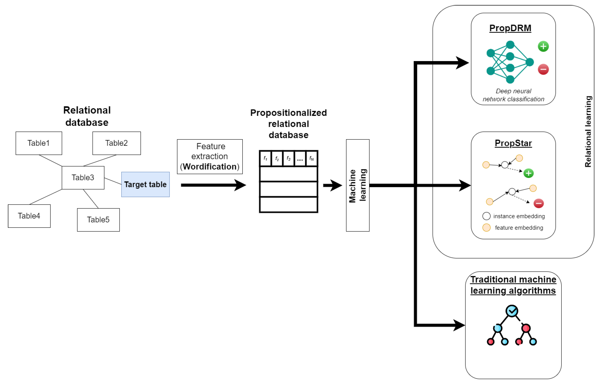

# Automating Feature Extraction from Entity-Relation Models: Experimental Evaluation of Machine Learning Methods for Relational Learning
With the exponential growth of data, extracting actionable insights becomes resource-intensive. In many organizations, normalized relational databases store a significant portion of this data, where tables are interconnected through some relations. This paper explores relational learning, which involves joining and merging database tables, often normalized in the third normal form. The subsequent processing includes extracting features and utilizing them in machine learning (ML) models. In this paper, we experiment with the propositionalization algorithm (i.e., Wordification) for feature engineering. Next, we compare the algorithms PropDRM and PropStar, which are designed explicitly for multi-relational data mining, to traditional machine learning algorithms. Based on the performed experiments, we concluded that Gradient Boost, compared to PropDRM, achieves similar performance (F1 score, accuracy, and AUC) on multiple datasets. PropStar consistently underperformed on some datasets while being comparable to the other algorithms on others. In summary, the propositionalization algorithm for feature extraction makes it feasible to apply traditional ML algorithms for relational learning directly. In contrast, approaches tailored specifically for relational learning still face challenges in scalability, interpretability, and efficiency. These findings have a practical impact that can help speed up the adoption of machine learning in business contexts where data is stored in relational format without requiring domain-specific feature extraction.

https://www.mdpi.com/2504-2289/8/4/39



If you use this code, please cite:
```
@Article{bdcc8040039,
AUTHOR = {Stanoev, Boris and Mitrov, Goran and Kulakov, Andrea and Mirceva, Georgina and Lameski, Petre and Zdravevski, Eftim},
TITLE = {Automating Feature Extraction from Entity-Relation Models: Experimental Evaluation of Machine Learning Methods for Relational Learning},
JOURNAL = {Big Data and Cognitive Computing},
VOLUME = {8},
YEAR = {2024},
NUMBER = {4},
ARTICLE-NUMBER = {39},
URL = {https://www.mdpi.com/2504-2289/8/4/39},
ISSN = {2504-2289},
ABSTRACT = {With the exponential growth of data, extracting actionable insights becomes resource-intensive. In many organizations, normalized relational databases store a significant portion of this data, where tables are interconnected through some relations. This paper explores relational learning, which involves joining and merging database tables, often normalized in the third normal form. The subsequent processing includes extracting features and utilizing them in machine learning (ML) models. In this paper, we experiment with the propositionalization algorithm (i.e., Wordification) for feature engineering. Next, we compare the algorithms PropDRM and PropStar, which are designed explicitly for multi-relational data mining, to traditional machine learning algorithms. Based on the performed experiments, we concluded that Gradient Boost, compared to PropDRM, achieves similar performance (F1 score, accuracy, and AUC) on multiple datasets. PropStar consistently underperformed on some datasets while being comparable to the other algorithms on others. In summary, the propositionalization algorithm for feature extraction makes it feasible to apply traditional ML algorithms for relational learning directly. In contrast, approaches tailored specifically for relational learning still face challenges in scalability, interpretability, and efficiency. These findings have a practical impact that can help speed up the adoption of machine learning in business contexts where data is stored in relational format without requiring domain-specific feature extraction.},
DOI = {10.3390/bdcc8040039}
}
```
# Repo description
The repo contains the code required to reproduce the experiments from the original paper. Note, however, that cluster-level infrastructure is needed to obtain enough repetitions, so use at own risk. Minimal working examples are provided next.

## Installation
For full functionality, one needs:
1. starspace binary (re-complile if necessary via https://github.com/facebookresearch/StarSpace)
2. pip install -r requirements.txt

To create a useful example for the `README.md` file that explains how to use the script with the provided `parse_arguments()` function and the contents of the `default_config.yaml` file, you can write the documentation as follows:

---

## Usage

This script allows users to perform machine learning experiments with various classifiers on specified datasets. Before running the script, ensure that the necessary datasets are enabled in the `datasets.yaml` file

### Configuration

#### Datasets Configuration
Edit the `datasets.yaml` file to specify which databases should be used. You must enable the databases by setting `enabled: true` for each dataset you intend to use. Here is an example of how to enable a dataset in the YAML file:

```yaml
datasets:
  - sql_type: mssql
    database: woe
    target_schema: indoor_user_movement
    target_table: target
    target_column: class_label
    include_all_schemas: false
    enabled: true  # Set to true to enable this dataset
```

#### Classifiers Configuration
Edit the `default_config.yaml` file or another specified configuration file to customize the settings for the classifiers. Configure the classifier parameters as needed under the `classifiers` section. Here is an example configuration:

```yaml
classifiers:
  - name: random_forest_learner
    params:
      - n_estimators: [100, 200]
        max_depth: [null]
        min_samples_split: [2]
        min_samples_leaf: [1]
        representation_type: ["sklearn_tfidf"]

  - name: extra_tree_learner
    params:
      - n_estimators: [100, 300]
        max_depth: [null]
        min_samples_split: [2]
        min_samples_leaf: [1]
        representation_type: [sklearn_tfidf"]
```

### Command-line Arguments

The script accepts several command-line arguments to customize its execution:

- `--results_file`: Specifies the path to the results file where the output will be stored. Default is `experiments.csv`.
- `--config_file`: Specifies the path to the configuration file for classifiers. Default is `default_config.yaml`.
- `--folds`: Specifies the number of folds for cross-validation. Default is 10.

### Running the Script

To run the script with default settings, simply execute:

```bash
python benchmark_original.py
```

To specify a different results file and config file, and to change the number of folds used in the experiment, you can run:

```bash
python benchmark_original.py --results_file="my_results.csv" --config_file="my_config.yaml" --folds=5
```

This command will direct the script to use `my_results.csv` as the results file, `my_config.yaml` as the configuration file, and perform 5-fold cross-validation.

### Note

Ensure that all paths and parameters are correctly set according to your environment and requirements.

---

This documentation provides clear instructions on how to configure and run the script, along with explanations of each command-line argument, making it user-friendly and easy to understand.

## Use with own data
Current implementation works with sql dumps, as can be obtained directly from e.g., https://relational-data.org/


## Cite original paper
```
@Article{Lavrač2020,
author={Lavra{\v{c}}, Nada
and {\v{S}}krlj, Bla{\v{z}}
and Robnik-{\v{S}}ikonja, Marko},
title={Propositionalization and embeddings: two sides of the same coin},
journal={Machine Learning},
year={2020},
month={Jul},
day={01},
volume={109},
number={7},
pages={1465-1507},
abstract={Data preprocessing is an important component of machine learning pipelines, which requires ample time and resources. An integral part of preprocessing is data transformation into the format required by a given learning algorithm. This paper outlines some of the modern data processing techniques used in relational learning that enable data fusion from different input data types and formats into a single table data representation, focusing on the propositionalization and embedding data transformation approaches. While both approaches aim at transforming data into tabular data format, they use different terminology and task definitions, are perceived to address different goals, and are used in different contexts. This paper contributes a unifying framework that allows for improved understanding of these two data transformation techniques by presenting their unified definitions, and by explaining the similarities and differences between the two approaches as variants of a unified complex data transformation task. In addition to the unifying framework, the novelty of this paper is a unifying methodology combining propositionalization and embeddings, which benefits from the advantages of both in solving complex data transformation and learning tasks. We present two efficient implementations of the unifying methodology: an instance-based PropDRM approach, and a feature-based PropStar approach to data transformation and learning, together with their empirical evaluation on several relational problems. The results show that the new algorithms can outperform existing relational learners and can solve much larger problems.},
issn={1573-0565},
doi={10.1007/s10994-020-05890-8},
url={https://doi.org/10.1007/s10994-020-05890-8}
}

```
